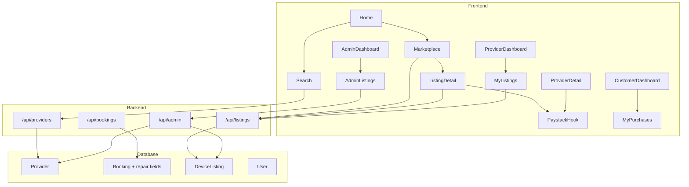

# Design Document: Device Repair & Marketplace

## Overview

This document describes the technical design for adding four new capabilities to the SuperConnect platform:

1. **Phone Repair Services** — customers book phone repair technicians via the existing provider/booking flow.
2. **Computer Repair Services** — customers book computer repair technicians via the same flow.
3. **Phone Buy & Sell Marketplace** — peer-to-peer phone listings with Paystack purchase flow.
4. **Computer Buy & Sell Marketplace** — peer-to-peer computer listings with the same purchase flow.

The repair services are a thin extension of the existing `Provider → Booking → Paystack` pipeline: two new service categories are added, and the `Booking` model gains repair-specific metadata fields. The marketplace is a new vertical that introduces a `DeviceListing` model, dedicated API routes, and new frontend pages, while reusing the existing auth middleware, Paystack hook, and notification patterns.

---

## Architecture



The backend follows the existing Express router pattern. Each new route file is registered in `index.ts`. The frontend follows the existing page-per-route pattern with `api/index.ts` for all HTTP calls.

---

## Components and Interfaces

### Backend

#### New / Modified Route Files

| File | Purpose |
|---|---|
| `routes/listings.ts` | CRUD + search for `DeviceListing` (already scaffolded, needs full implementation) |
| `routes/bookings.ts` | Extended to validate repair-specific fields on creation |
| `routes/admin.ts` | Extended with listing moderation and repair provider management endpoints |

#### New Model File

| File | Purpose |
|---|---|
| `models/DeviceListing.ts` | New Mongoose model for marketplace listings |

#### Service Categories (Frontend constant)

`SERVICE_CATEGORIES` in `frontend/src/types/index.ts` gains two canonical entries:
- `"Phone Repair"`
- `"Computer Repair"`

(The existing `"Phone Repair Technician"` and `"Computer Repair Technician"` entries are replaced with the canonical names to match the requirements.)

### Frontend

#### New Pages

| Page | Route | Purpose |
|---|---|---|
| `Marketplace.tsx` | `/marketplace` | Browse and filter all active device listings |
| `ListingDetail.tsx` | `/marketplace/:id` | View full listing details and initiate purchase |
| `CreateListing.tsx` | `/marketplace/create` | Authenticated form to create a phone or computer listing |

#### Modified Pages

| Page | Change |
|---|---|
| `Home.tsx` | Add Marketplace nav link and category cards for Phone Repair / Computer Repair |
| `ProviderDetail.tsx` | Show repair-specific booking fields (device brand, model, fault) for repair categories |
| `ProviderDashboard.tsx` | Show seller's own listings section |
| `CustomerDashboard.tsx` | Show purchased listings section |
| `AdminDashboard.tsx` | Add listing moderation tab and repair provider management tab |
| `Navbar.tsx` | Add Marketplace link |
| `App.tsx` | Register new routes |

---

## Data Models

### DeviceListing (new)

```typescript
interface IDeviceListing extends Document {
  // Common fields
  device_type: 'phone' | 'computer';
  title: string;
  description: string;
  price: number;                          // NGN, minimum 1
  condition: 'new' | 'fairly-used' | 'refurbished';
  brand: string;
  model: string;
  images: string[];                       // 1–6 URLs
  seller: mongoose.Types.ObjectId;        // ref: User
  state: string;
  city: string;
  status: 'active' | 'sold' | 'removed';
  buyer?: mongoose.Types.ObjectId;        // ref: User, set on purchase
  paymentReference?: string;             // Paystack ref, set on purchase

  // Phone-specific (required when device_type === 'phone')
  storageCapacity?: string;              // e.g. "128GB"
  colour?: string;

  // Computer-specific (required when device_type === 'computer')
  ram?: string;                          // e.g. "16GB"
  storageSize?: string;                  // e.g. "512GB SSD"
  processor?: string;                    // e.g. "Intel Core i7"
}
```

Indexes: `{ status: 1 }`, `{ device_type: 1 }`, `{ seller: 1 }`, `{ state: 1 }`, text index on `{ title, brand, model }`.

### Booking (extended)

The existing `Booking` model gains optional repair metadata fields:

```typescript
// Added to IBooking
deviceBrand?: string;
deviceModel?: string;
deviceSubtype?: string;   // 'laptop' | 'desktop' — for Computer Repair only
faultDescription?: string;
```

These fields are populated by the frontend when the provider's category is `Phone Repair` or `Computer Repair`.

### Provider (unchanged)

The existing `Provider` model already supports `category: string` and `skills: string[]`. No schema changes are needed — the new categories are stored as string values.

---

## Correctness Properties

*A property is a characteristic or behavior that should hold true across all valid executions of a system — essentially, a formal statement about what the system should do. Properties serve as the bridge between human-readable specifications and machine-verifiable correctness guarantees.*

### Property 1: Repair category filter correctness

*For any* search query with a repair category filter (`Phone Repair` or `Computer Repair`), every provider returned by the Search_Service must have a `category` field equal to the requested repair category.

**Validates: Requirements 1.2, 2.2**

---

### Property 2: Repair booking requires device metadata

*For any* booking creation request targeting a `Phone Repair` or `Computer Repair` provider that is missing `deviceBrand`, `deviceModel`, or `faultDescription`, the system must reject the request with a validation error and must not persist a Booking record.

**Validates: Requirements 1.4, 2.4**

---

### Property 3: Booking only exists with payment reference

*For any* Booking record in the database whose provider has category `Phone Repair` or `Computer Repair`, the `paymentReference` field must be non-empty.

**Validates: Requirements 1.5, 2.5**

---

### Property 4: Unavailable provider blocks booking

*For any* provider with `isAvailable: false`, a booking creation request targeting that provider must be rejected with an error, and no Booking record must be created.

**Validates: Requirements 1.6, 2.6, 10.4**

---

### Property 5: Rating only accepted on completed bookings

*For any* booking, submitting a rating between 1 and 5 must succeed if and only if the booking status is `completed`. For any booking with a status other than `completed`, the rating submission must be rejected.

**Validates: Requirements 1.7, 2.7**

---

### Property 6: New listing defaults to active status

*For any* successfully created `DeviceListing`, the `status` field must equal `active` immediately after creation, regardless of device type, price, or other fields.

**Validates: Requirements 4.2, 5.2**

---

### Property 7: Listing creation round-trip

*For any* valid `DeviceListing` payload (phone or computer), creating the listing and then fetching it by ID must return a document whose fields match the submitted payload, including all device-type-specific fields.

**Validates: Requirements 4.1, 5.1**

---

### Property 8: Invalid listing payload is rejected

*For any* listing creation request missing at least one required field (title, price, condition, brand, model, state, city, or images), the system must return a validation error and must not create a `DeviceListing` record. This includes the edge cases of price < 1 NGN and image count outside [1, 6].

**Validates: Requirements 4.3, 4.4, 4.5, 5.3, 5.4, 5.5**

---

### Property 9: Marketplace returns only active listings

*For any* marketplace browse request (with or without filters), every `DeviceListing` in the response must have `status: active`.

**Validates: Requirements 6.1**

---

### Property 10: Combined filter correctness

*For any* combination of filters (device_type, state, price range, condition, keyword), every listing returned must satisfy all applied filters simultaneously. Keyword matching must be case-insensitive against title, brand, and model.

**Validates: Requirements 6.2, 6.3, 6.4, 6.5, 6.6, 6.7**

---

### Property 11: Device-type-specific fields in listing detail

*For any* `DeviceListing` with `device_type: phone`, the API response must include `storageCapacity` and `colour`. *For any* `DeviceListing` with `device_type: computer`, the API response must include `ram`, `storageSize`, `processor`, and `colour`.

**Validates: Requirements 7.2, 7.3**

---

### Property 12: Successful purchase marks listing as sold

*For any* `active` `DeviceListing`, after a successful Paystack payment confirmation, the listing's `status` must be `sold`, the `buyer` field must reference the purchasing user, and the `paymentReference` must be recorded. Any subsequent purchase attempt on that listing must be rejected.

**Validates: Requirements 8.2, 8.5**

---

### Property 13: Failed payment preserves active status

*For any* `active` `DeviceListing`, if the payment flow returns a failure or cancellation, the listing's `status` must remain `active`.

**Validates: Requirements 8.4**

---

### Property 14: Listing edit preserves creation date

*For any* `active` `DeviceListing`, editing any field must update the stored values but must not change the `createdAt` timestamp.

**Validates: Requirements 9.2**

---

### Property 15: Removed listing absent from search

*For any* `DeviceListing` whose `status` is set to `removed`, that listing must not appear in any marketplace search or browse response.

**Validates: Requirements 9.3, 10.2**

---

### Property 16: Sold listing rejects price/condition edits

*For any* `DeviceListing` with `status: sold`, a request to update the `price` or `condition` field must be rejected with an error.

**Validates: Requirements 9.4**

---

### Property 17: Chat room created with repair booking

*For any* successfully created `Repair_Booking`, a Socket.io room keyed by the booking ID must be joinable by both the customer and the provider.

**Validates: Requirements 11.2**

---

## Error Handling

| Scenario | HTTP Status | Response |
|---|---|---|
| Missing required listing field | 400 | `{ message: "Field X is required" }` |
| Price < 1 NGN | 400 | `{ message: "Price must be at least ₦1" }` |
| Image count outside [1, 6] | 400 | `{ message: "Between 1 and 6 images are required" }` |
| Booking for unavailable provider | 400 | `{ message: "Provider is not currently available" }` |
| Missing repair metadata on booking | 400 | `{ message: "Device brand, model, and fault description are required for repair bookings" }` |
| Rating on non-completed booking | 400 | `{ message: "Booking must be completed before rating" }` |
| Purchase of non-active listing | 400 | `{ message: "This listing is no longer available" }` |
| Edit price/condition on sold listing | 400 | `{ message: "Cannot edit price or condition of a sold listing" }` |
| Unauthenticated access to protected routes | 401 | `{ message: "No token, unauthorized" }` |
| Resource not found | 404 | `{ message: "Not found" }` |
| Unexpected server error | 500 | `{ message: "Server error" }` |

All validation errors are returned before any database write. The Paystack payment flow errors are surfaced to the frontend via toast notifications using the existing `react-hot-toast` pattern.

---

## Testing Strategy

### Dual Testing Approach

Both unit tests and property-based tests are required. Unit tests cover specific examples and integration points; property-based tests verify universal correctness across randomised inputs.

### Unit Tests

Focus areas:
- Specific valid and invalid listing creation examples (phone and computer)
- Booking creation with and without repair metadata
- Admin moderation actions (remove listing, deactivate provider)
- Purchase flow: active → sold transition and sold → purchase rejection
- Seller edit restrictions on sold listings
- Filter combinations returning correct subsets

### Property-Based Tests

**Library**: `fast-check` (TypeScript-compatible, works with Jest/Vitest)

**Configuration**: minimum 100 runs per property (`{ numRuns: 100 }`)

Each property test is tagged with a comment in the format:
`// Feature: device-repair-and-marketplace, Property N: <property text>`

**Property test mapping:**

| Property | Test Description |
|---|---|
| Property 1 | Generate random provider arrays with mixed categories; assert filter returns only matching category |
| Property 2 | Generate random repair booking payloads with missing fields; assert all are rejected |
| Property 3 | Generate bookings; assert every persisted booking has a non-empty paymentReference |
| Property 4 | Generate providers with isAvailable=false; assert booking creation always fails |
| Property 5 | Generate bookings with random statuses; assert rating succeeds iff status=completed |
| Property 6 | Generate valid listing payloads; assert created listing always has status=active |
| Property 7 | Generate valid listing payloads; create then fetch; assert round-trip equality |
| Property 8 | Generate listing payloads with random missing/invalid fields; assert all rejected |
| Property 9 | Seed listings with mixed statuses; assert browse returns only active |
| Property 10 | Generate random filter combinations and listing sets; assert all results satisfy all filters |
| Property 11 | Generate phone and computer listings; assert device-type-specific fields present in response |
| Property 12 | Generate active listings; simulate payment success; assert status=sold and re-purchase rejected |
| Property 13 | Generate active listings; simulate payment failure; assert status remains active |
| Property 14 | Generate active listings; edit fields; assert createdAt unchanged |
| Property 15 | Remove listings; assert absent from all search responses |
| Property 16 | Generate sold listings; attempt price/condition edit; assert all rejected |
| Property 17 | Generate repair bookings; assert Socket.io room exists for each booking ID |
